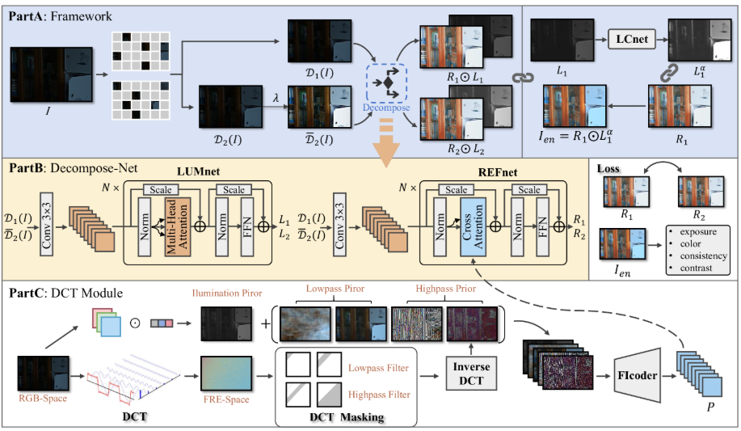
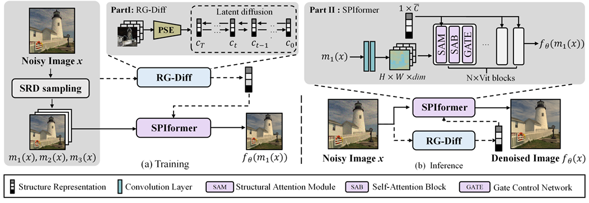
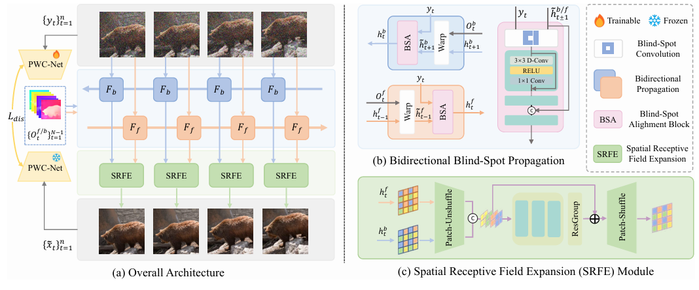
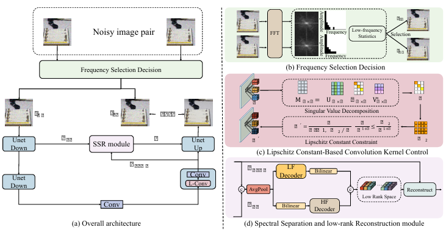
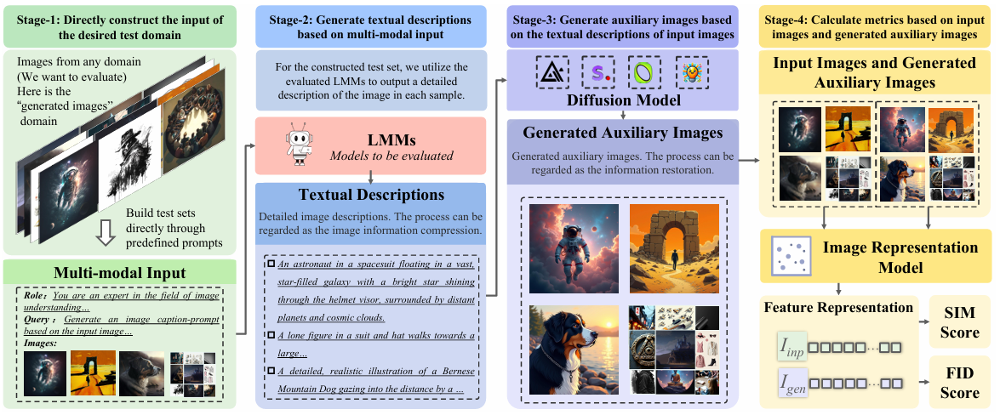



Publications
======

ICLR 2025

<a href="https://arxiv.org/abs/2503.14535" style="font-size: 22px; color: #483D8B; text-decoration: none">**Interpretable Unsupervised Joint Denoising and Enhancement for Real-World low-light Scenarios**</a> 
**Huaqiu Li**, Xiaowan Hu, Haoqian Wang† 
[**Openreview**](https://openreview.net/forum?id=PVHoELf5UN&noteId=tWR79MUc4B)   [**Paper**](https://arxiv.org/abs/2503.14535)   [**Code**](https://github.com/huaqlili/unsupervised-light-enhance-ICLR2025)

- We propose an interpretable, zero-reference joint denoising and low-light enhancement framework tailored for real-world scenarios. Our method derives a training strategy based on paired sub-images with varying illumination and noise levels, grounded in physical imaging principles and retinex theory.

AAAI 2025

<a href="https://arxiv.org/abs/2502.06432" style="font-size: 22px; color: #483D8B; text-decoration: none">**Prompt-SID: Learning Structural Representation Prompt via Latent Diffusion for Single-Image Denoising**</a> 
**Huaqiu Li**\*, Wang Zhang\*, Xiaowan Hu, Tao Jiang, Zikang Chen, Haoqian Wang† 
[**Paper**](https://arxiv.org/abs/2502.06432)   [**Code**](https://github.com/huaqlili/Prompt-SID)

-  In this paper, we introduce Prompt-SID, a prompt-learning-based single image denoising framework that emphasizes preserving of structural details. This approach is trained in a self-supervised manner using downsampled image pairs.

AAAI 2025

<a href="https://arxiv.org/abs/2502.06432" style="font-size: 22px; color: #483D8B; text-decoration: none">**Spatiotemporal Blind-Spot Network with Calibrated Flow Alignment for Self-Supervised Video Denoising**</a> 
Chen, Zikang ; Jiang, Tao ; Hu, Xiaowan ; Zhang, Wang ; **Li, Huaqiu** ; Wang, Haoqian† 
[**Paper**](https://ojs.aaai.org/index.php/AAAI/article/view/32242)   [**Code**](https://github.com/ZKCCZ/STBN)

-  We first explore the practicality of optical flow in the self-supervised setting and introduce a SpatioTemporal Blind-spot Network (STBN) for global frame feature utilization.

ICME 2025

<a href="" style="font-size: 22px; color: #483D8B; text-decoration: none">**Measuring and Controlling the Spectral Bias in Self-Supervised Denoising**</a> 
Wang Zhang\*, **Huaqiu Li**\*, Tao Jiang, Zikang Chen, Haoqian Wang† 
[**Paper**]()   [**Code**]()

-  We introduce a Spectral Controlling network (SCNet) to optimize self-supervised denoising of paired noisy images. First, we propose a selection strategy to choose frequency band components for noisy images, to accelerate the convergence speed of training.

Preprints
======

Arxiv 2024

<a href="https://arxiv.org/abs/2411.14062" style="font-size: 22px; color: #483D8B; text-decoration: none">**MMGenBench: Fully Automatically Evaluating LMMs from the Text-to-Image Generation Perspective**</a> 
Hailang Huang, Yong Wang, Zixuan Huang, **Huaqiu Li**, Tongwen Huang, Xiangxiang Chu, Richong Zhang† 
[**Paper**](https://arxiv.org/abs/2411.14062)   [**Code**](https://github.com/lerogo/MMGenBench)

-  We propose the MMGenBench-Pipeline, a straightforward and fully automated evaluation pipeline. This involves generating textual descriptions from input images, using these descriptions to create auxiliary images via text-to-image generative models, and then comparing the original and generated images.

