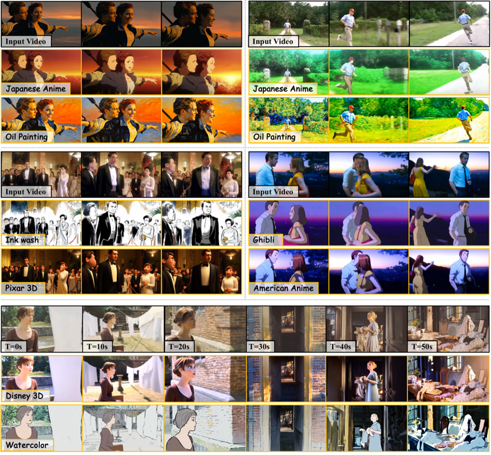
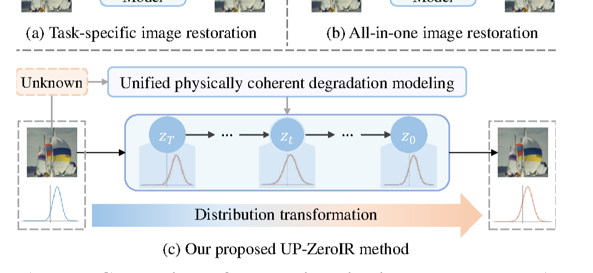
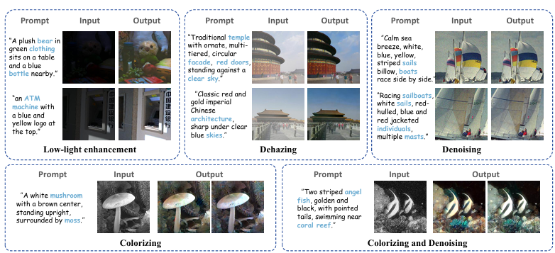
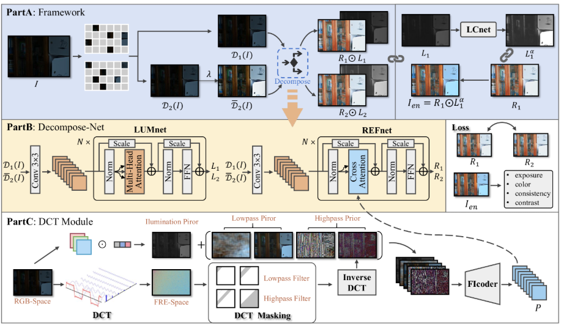
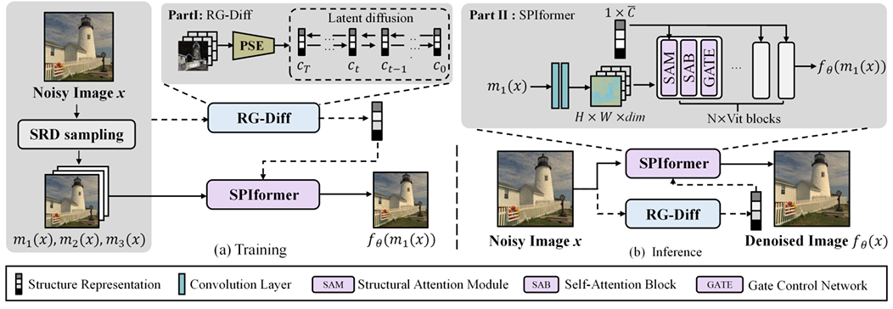
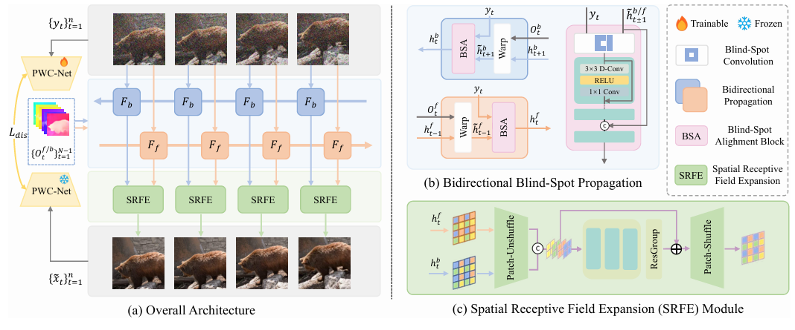
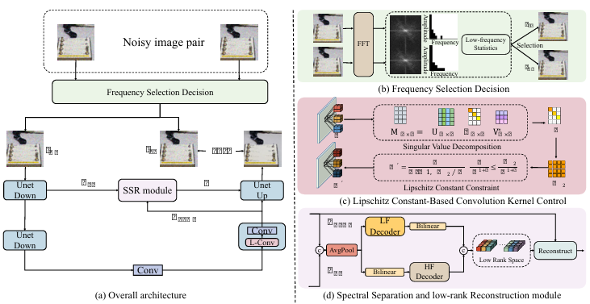



Publications
======

ECCV 2026

<a href="https://echostyle2026.github.io/" style="font-size: 22px; color: #483D8B; text-decoration: none">**EchoStyle: Unlocking High-Fidelity Video Stylization with Reverse Data Synthesis**</a> 
**Huaqiu Li**\*, Jiahao Wang\*, Sijia Cai†, Hualian Sheng, Bing Deng, Jieping Ye, Wenhan Luo† 
[**Project**](https://echostyle2026.github.io/)   [**Paper**](https://arxiv.org/abs/2606.25465)   [**Code**](https://github.com/HKUST-C4G/EchoStyle)   [**Model**](https://huggingface.co/youchun/echostyle)

- We introduce EchoStyle, a scalable text-driven framework for high-fidelity video stylization of arbitrary-length videos. It combines a video-to-video architecture, the reverse-synthesized V-Style20k dataset, and init-follow-mode sliding-window inference to preserve style, motion, and temporal consistency.

CVPR 2026

<a href="https://arxiv.org/abs/2605.24593" style="font-size: 22px; color: #483D8B; text-decoration: none">**Self-supervised Dynamic Heterogeneous Degradation Modeling for Unified Zero-Shot Image Restoration**</a> 
Xiaowan Hu\*, Jing Yang\*, Henan Liu, **Huaqiu Li**, Mai Xu† 
[**CVF**](https://openaccess.thecvf.com/content/CVPR2026/papers/Hu_Self-supervised_Dynamic_Heterogeneous_Degradation_Modeling_for_Unified_Zero-Shot_Image_Restoration_CVPR_2026_paper.pdf)   [**arXiv**](https://arxiv.org/abs/2605.24593)

- We propose UP-ZeroIR, a self-supervised unified physical zero-shot restoration framework that models heterogeneous degradations as a homogeneous latent-space distribution. A dynamic quality-refinement strategy adaptively adjusts the diffusion trajectory for robust restoration across both single and mixed degradations.

ICCV 2025

<a href="{{ site.baseurl }}/papers/ld-rps/" style="font-size: 22px; color: #483D8B; text-decoration: none">**LD-RPS: Zero-Shot Unified Image Restoration via Latent Diffusion Recurrent Posterior Sampling**</a> 
**Huaqiu Li**, Yong Wang†, Tongwen Huang, Hailang Huang, Haoqian Wang†, Xiangxiang Chu 
[**Project**]({{ site.baseurl }}/papers/ld-rps/)   [**ICCV**](https://openaccess.thecvf.com/content/ICCV2025/html/Li_LD-RPS_Zero-Shot_Unified_Image_Restoration_via_Latent_Diffusion_Recurrent_Posterior_ICCV_2025_paper.html)   [**Paper**](https://arxiv.org/abs/2507.00790)   [**Code**](https://github.com/huaqlili/LD-RPS)

- We propose a dataset-free, task-blind unified image restoration approach based on recurrent posterior sampling with a pretrained latent diffusion model and semantic priors from a multimodal understanding model.

ICLR 2025

<a href="{{ site.baseurl }}/papers/interpretable-low-light/" style="font-size: 22px; color: #483D8B; text-decoration: none">**Interpretable Unsupervised Joint Denoising and Enhancement for Real-World Low-Light Scenarios**</a> 
**Huaqiu Li**, Xiaowan Hu, Haoqian Wang† 
[**Project**]({{ site.baseurl }}/papers/interpretable-low-light/)   [**ICLR**](https://proceedings.iclr.cc/paper_files/paper/2025/hash/6264f71a529a6d83a7a5dd3530f4f321-Abstract-Conference.html)   [**OpenReview**](https://openreview.net/forum?id=PVHoELf5UN)   [**Paper**](https://arxiv.org/abs/2503.14535)   [**Code**](https://github.com/huaqlili/unsupervised-light-enhance-ICLR2025)

- We propose an interpretable, zero-reference joint denoising and low-light enhancement framework tailored for real-world scenarios. Our method derives a training strategy based on paired sub-images with varying illumination and noise levels, grounded in physical imaging principles and retinex theory.

AAAI 2025

<a href="{{ site.baseurl }}/papers/prompt-sid/" style="font-size: 22px; color: #483D8B; text-decoration: none">**Prompt-SID: Learning Structural Representation Prompt via Latent Diffusion for Single-Image Denoising**</a> 
**Huaqiu Li**\*, Wang Zhang\*, Xiaowan Hu, Tao Jiang, Zikang Chen, Haoqian Wang† 
[**Project**]({{ site.baseurl }}/papers/prompt-sid/)   [**AAAI**](https://ojs.aaai.org/index.php/AAAI/article/view/32500)   [**Paper**](https://arxiv.org/abs/2502.06432)   [**Code**](https://github.com/huaqlili/Prompt-SID)

- Prompt-SID is a self-supervised single-image denoising framework that preserves structural details by learning a latent structural representation from the noisy image; “prompt” here does not mean a natural-language prompt.

AAAI 2025

<a href="https://arxiv.org/abs/2502.06432" style="font-size: 22px; color: #483D8B; text-decoration: none">**Spatiotemporal Blind-Spot Network with Calibrated Flow Alignment for Self-Supervised Video Denoising**</a> 
Chen, Zikang ; Jiang, Tao ; Hu, Xiaowan ; Zhang, Wang ; **Li, Huaqiu** ; Wang, Haoqian† 
[**Paper**](https://ojs.aaai.org/index.php/AAAI/article/view/32242)   [**Code**](https://github.com/ZKCCZ/STBN)

-  We first explore the practicality of optical flow in the self-supervised setting and introduce a SpatioTemporal Blind-spot Network (STBN) for global frame feature utilization.

ICME 2025

<a href="" style="font-size: 22px; color: #483D8B; text-decoration: none">**Measuring and Controlling the Spectral Bias in Self-Supervised Denoising**</a> 
Wang Zhang\*, **Huaqiu Li**\*, Tao Jiang, Zikang Chen, Haoqian Wang† 
[**Paper**]()   [**Code**]()

-  We introduce a Spectral Controlling network (SCNet) to optimize self-supervised denoising of paired noisy images. First, we propose a selection strategy to choose frequency band components for noisy images, to accelerate the convergence speed of training.

